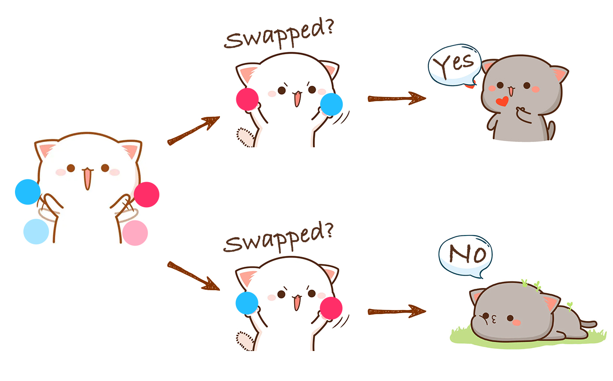
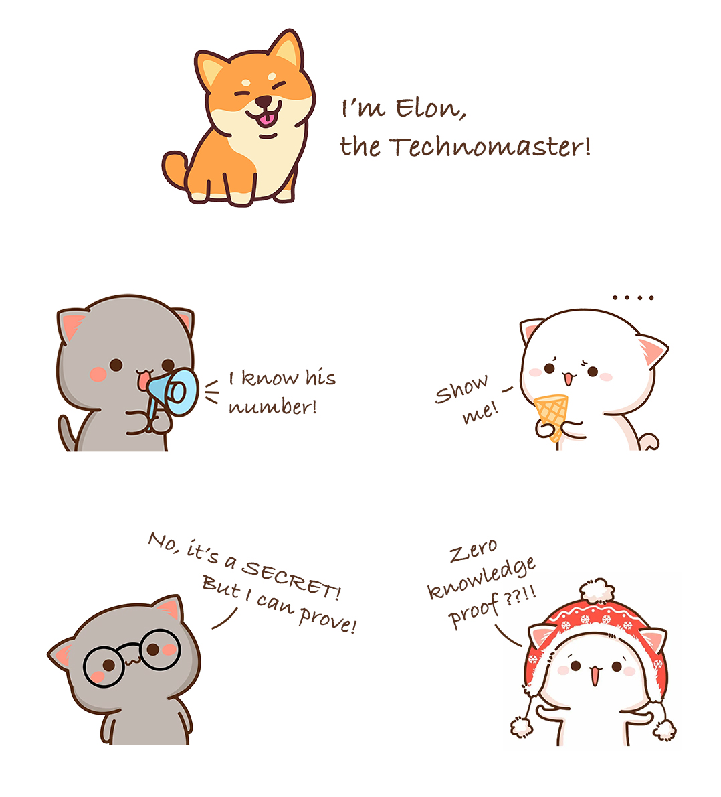
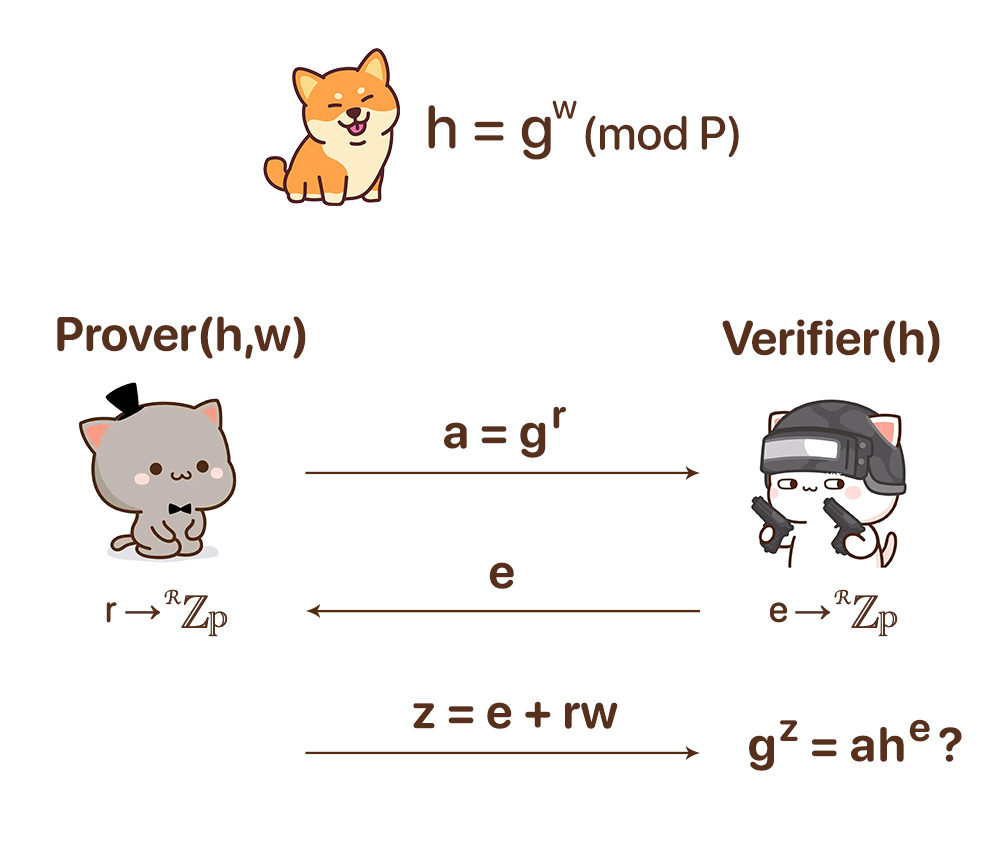
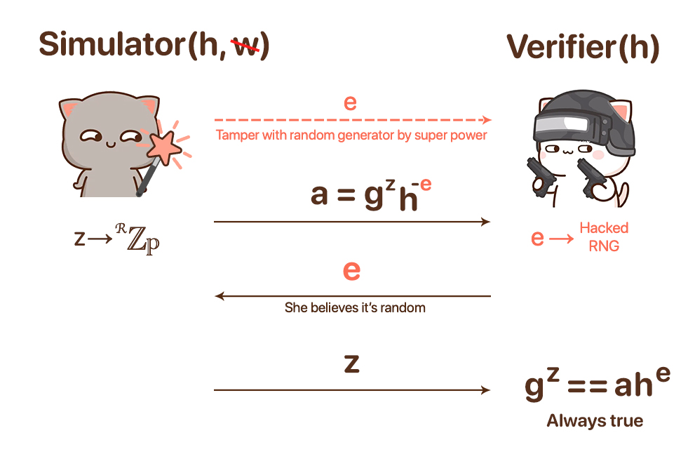
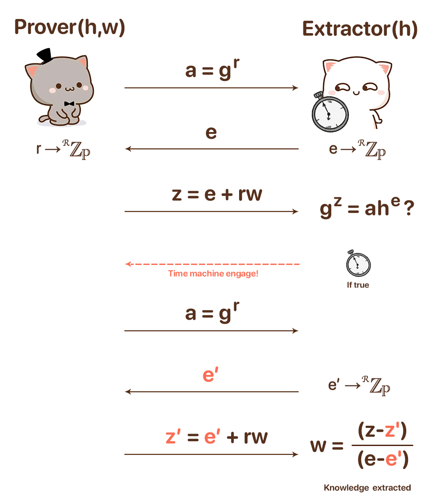

# Simple and Practical Zero Knowledge Proof Explanation 

You've presumably read some articles trying to explain the Zero-Knowledge technology but are still confused about its nature due to the incompatibleness between those articles' main arguments and your aha moment:

- Too naive to explain in a deeper perspective, i.e., only employ some physical or real-world games or stories to exemplify ZK, without any insight into how it is implemented in practice and why it works.
- Too overwhelming for a beginner to understand, filled with plenty of cryptography jargon, mathematical formulas, academic papers, etc. 

This article will provide a simple yet insightful elaboration for ZK in math, cryptography, and coding, with minimal prerequisite knowledge.

# Proof of colours for colour blindness 
How to tell colour-blind people that two balls of distinct colours are literally different? It's not complicated:

Let him hold those two balls in hand, hide behind his body, and swap their position randomly. Then he shows you the balls, and you tell him whether the balls were swapped.

From his perspective, you can answer correctly by guessing. But repeat this process 100 or even more times: if you're always able to deliver the correct answer, the probability of guessing all by luck is negligible. Consequently, we can convince our colour-blind friend we are not lying about the truth that these two balls are different in colour and our ability to perceive and distinguish.

The proving method above is precisely a kind of zero-knowledge proof:
- Verifier never learns any knowledge of colour because he's still not able to distinguish them after the test.
- It's probabilistic proof instead of deterministic proof.
- It's interactive and multi-round. There are also non-interactive ZKP schemes with advanced transformation techniques.

# Proof of Knowledge
We've seen an example of ZKP in the physical world. Now let's delve into cyberspace.

Arthur is Elon's friend, and he knows Elon's phone number. Betty doesn't know it, but Arthur wants to prove that he does without disclosing it to Betty, so how to do it?

A naive way is that Elon publishes a hash of his phone number, and Arthur enters the pre-image of that hash via a programme for hash calculation check. But this method is fundamentally flawed due to:

- Betty can brute-force the pre-image according to its hash to get the nearly deterministic single result with non-negligible odds.
- Arthur must input the pre-image to that programme. Betty will suspect it will always return a positive pass if it's on Arthur's computer. 
- On the other hand, Arthur is afraid that Betty will steal the knowledge she typed if it's on Betty's side. 
- As you can't separate the runtime to let Arthur and Betty run different codes on their own machines respectively, this trust issue is hard to solve.

So the regular easy way won't work. Time for ZKP to show up.

# Implementation of a Cryptography Based ZKP
I'm gonna use a relatively simple ZKP scheme named Sigma Protocol here to solve this problem. Also, for the sake of simplicity and comprehensibility, rigorous definition / terminology / inference of cryptography or arithmetic won't be adopted here.

## Core Procedures
To prove one has certain knowledge with ZKP, we can do it by the following procedures:

1. Set a finite group G of order `P` and its generator `g`. We can ignore what these weirdos mean first.
2. With the terms defined above, a third party who has or has access to the knowledge(denoted by w) publishes the encrypted knowledge `h = g^w (mod P)`.
3. Prover starts the proving procedure. Generate a random number r, evaluate `a = g^r`, and send value `a` to Verifier.
4. Verifier generates a random number `e` and sends it to Prover.
5. Prover evaluates z = r + ew and sends it to Verifier.
6. Verifier checks `g^z == a·h^e(mod P)`. If true, Prover has the claimed knowledge.

Well, the protocol just finished here! It's short, but still seems a little bit overwhelming with these mathematical denotations. But it will be ok to have an overview first and delve into the details later.

## Programme Example
I wrote an easy toy programme for Sigma Protocol in Python. You can cosplay the 3rd party knowledge publisher who defines the knowledge and the Prover with or without the exact knowledge waiting to be verified. It's pretty helpful for understanding the above procedures. 

Just `python example.py`.

## Mathematical Principle
The core working mechanism is the hardness of Discrete Logarithm: when P is a big prime number, given h, it's hard to find w such that `h = g^w(mod P).` This property also applies to similar equations above.

Let's take it step by step:
Encrypted knowledge `h = g^w (mod P).` Here we encrypted the knowledge into a form that is hard to brute-force. And due to the nature of modulo operation, there's no definite single solution even if it's "compromised". This means it's infeasible for the Prover to cheat or for the Verifier to obtain knowledge by cracking it.

Then, we take steps 3,4,5 as a whole to understand why they are exchanging random numbers:

I. Prover doesn't want to reveal his secret knowledge, so he must encrypt that value with randomness to lock it up. The Verifier also needs to transform it to a checkable one to verify its validity while maintaining its secrecy by adding some randomness from Verifier. 

II. If the Verifier sends the random number `e` first(i.e., swap steps 3 & 4), it's obvious Prover can make up `a = g^z·h^-e` such that it satisfies the final check even without knowing the knowledge. So Prover must first send a commitment(a=g^r) but not the random number r itself to avoid the cheating scenario, also disabling the way for the Verifier to extract knowledge w by evaluating `w = (z - r)/e`.

III. After receiving the commitment, Verifier sends a random number `e` as a challenge to Prover. It's not encrypted as no info can be inferred from it or further derivatives. Then Prover returns z = r + ew to Verifier. Verifier runs the final equality check `g^z= g^(r+ew)= g^r·(gw)^e= a·h^e`.

With this interlacing weave structure, we got 3 sophisticated properties: 

**Completeness**:
The Prover will pass the verification if and only if he entered the correct knowledge.

**Soundness**:
The Prover will fail to pass the verification if and only if he entered a wrong knowledge.

**Zero-knowledge(-ness)**:
Verifier won't obtain any knowledge during the verification.

They are just the very core essences of ZKP. Marvellous and melodramatic, isn't it? Congrats, you've made it this far, where I can assume you just entered a panoramic view of Zero-knowledge space. Have fun!

## Further Reading

### Simulator & Zero-knowledge(-ness)
Let's consider some supernatural forces. A Prover, who has the ability to predict or tamper with Verifier's random number `e` before its generation, we call him the Simulator.

As in term II above, this ability literally means the Simulator is able to compose the commitment `a` to deceive Verifier. So whatever the input from the Simulator is, the Verifier will always accept it as true.

Easy to see, in such a manner, Verifier can't obtain any knowledge in this protocol, i.e., the Zero-knowledge property holds true:
Perfect zero-knowledge <== ∀ Simulator S s.t. S(x) is indistinguishable from a real proof execution, where S(x):
Choose random `z` and `e`, and let `a = g^z·h^-e,` where (a,e,z) have the same distribution as in a real run random values satisfying `g^z=a·h^e.`

### Extractor & Soundness
Another supernatural force comes into play, the Extractor, with the ability to rewind time. She acts as Verifier vs. a normal Prover.

When the protocol finishes, Extractor launches her time rewind attack to dial back the clock to the beginning of the protocol, with `(z, e, a)` in the previous execution. Now the protocol replays, but Extractor sends a different random `e'` to Prover, who is not a time traveller so still outputs the same random `r`, also `a = g^r`.

Now, Extractor has:
`g^z= a·h^e, g^z'=a·h^e => g^(z-z') = h(e-e') `=> Encrypted Knowledge `h = g^((z-z')/(e-e'))` => Knowledge `w = (z-z')/(e-e')`.

Obviously, an Extractor can always extract knowledge as long as Prover owns it, i.e., the Soundness property holds true:
Soundness <==  ∀ extractor E that given any h and pair of transcripts `(a,e,z)`,`(a,e',z')` with `e≠e'` outputs `w` s.t. (h,w) ∈ R.

### Completeness
There's no need to prove Completeness with any special character as this holds true:
`g^z` = `g^r+ew` = `g^r·(g^w)^e` = `a·h^e`.
